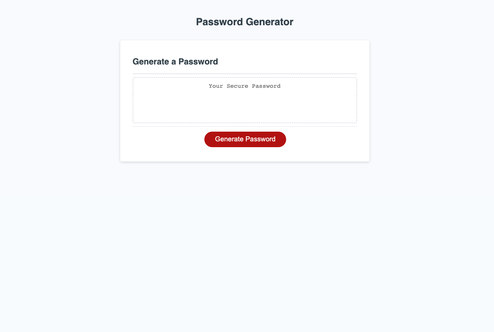
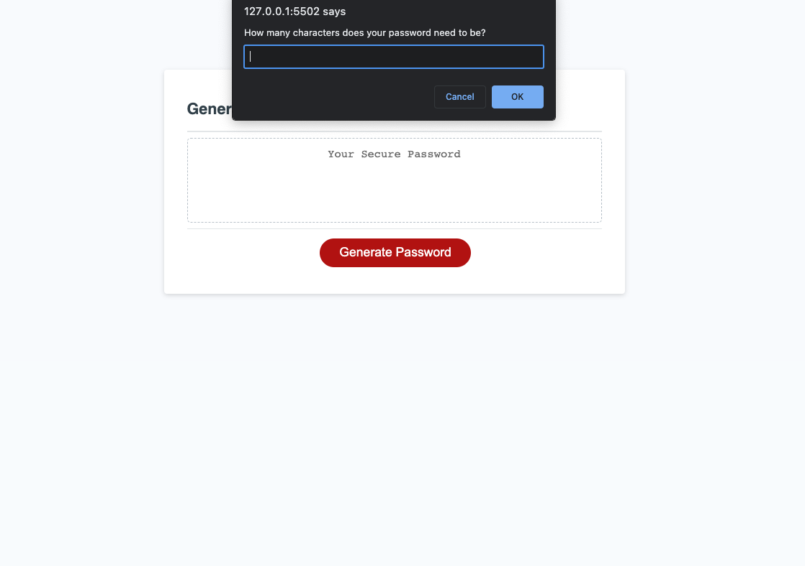
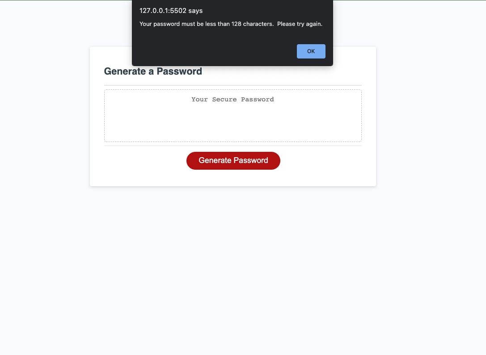
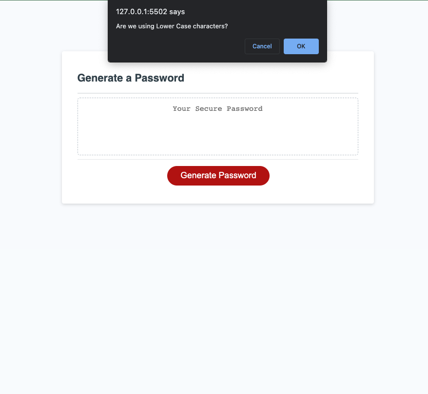
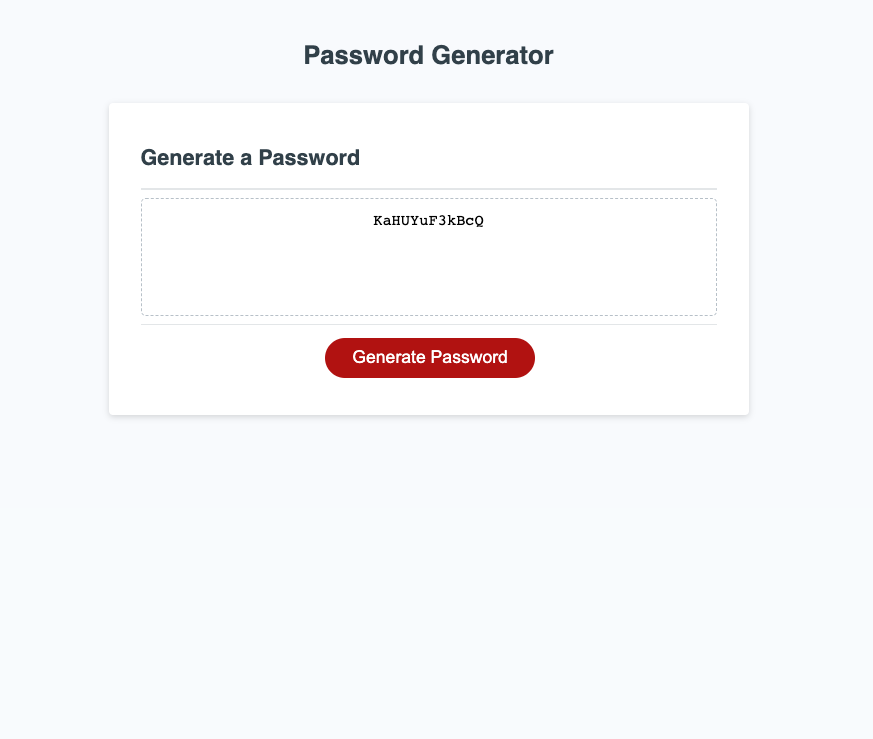

# password-generator-random
## A random password generator! 

This password generator was created to help move your password generating up to the next level. 
The password generating tool will use your given criteria to make a password that fits your needs. 
You can then copy and paste it into whichever account you like. 

## Usage
Please visit my [Site!]([https://link-url-here.org](https://tayskully.github.io/password-generator-random/))
In order to get the full experience, users must first click the "Generate Password" button in order to prompt the algorithm. Once the button has been pressed, the browser will ask you for your preferred password criteria. 
With every answer given, the functions will work to create a perfect password for you. Choose any option! your password will be generated. 

The interaction may look like the following screenshots: 

## Credits

The collaborators on this project include me, myself, and Taylor
@tayskully 
 third-party assets
 Tutorials followed include Columbia University EdX's Coding Bootcamp 2023, as well as:  
 [Github Docs](https://docs.github.com/en)  
 [developer mozilla](https://developer.mozilla.org/en-US/)  
 [Dev.to](https://dev.to/)  
 [Code Academy blogs](https://www.codecademy.com/resources/blog/)  

 Special thanks to my tutor Erik Hirsch, and my friend Rima Alrwais for their code input. 

## License
MIT License
